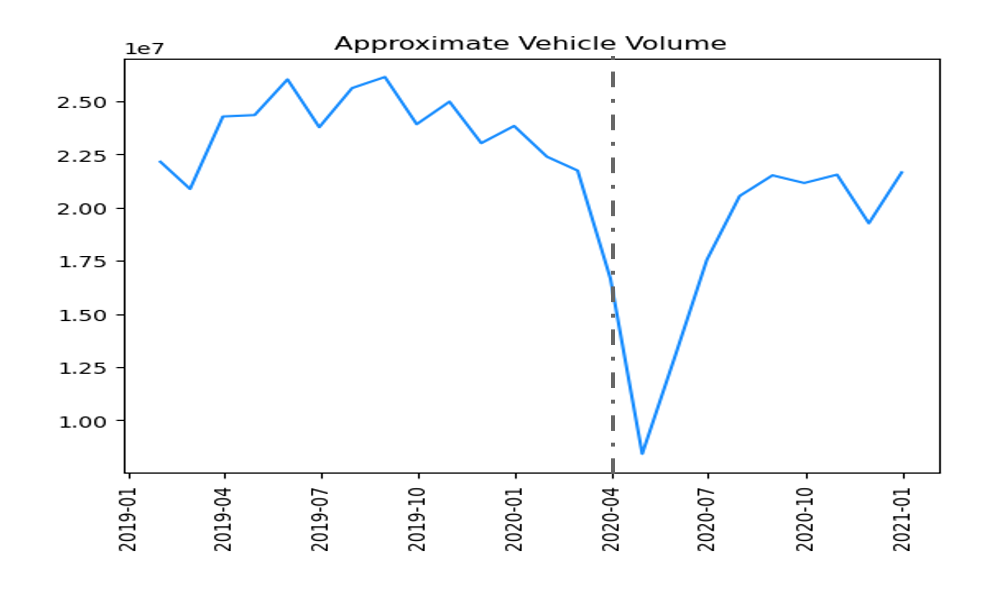
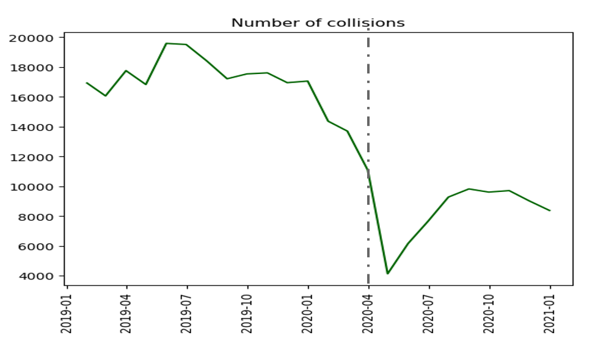

# NYC Traffic Collisions Analysis

## Objective:
[Shefer and Rietveld, 1997](https://doi.org/10.1080/0042098975970) proposes the impact of variations in traffic density to the number and severity of traffic collisions. The lockdown imposed due to COVID pandemic provides a convenient sitaution to check the impact of sudden decrease in traffic density to traffic accidents happening in the NYC area. However, since the change in traffic density can also be intentionally or unintentially brought about due to congestion taxes policies, traffic law changes, public transport schemes, restructuring of roads, etc. it is important to understand its impact on traffic accidents so that policy makers can make better decisions in the future to help ensure the safety of residents of NYC.

There are 2 goals of this project:
1. Analyze the impact of changes in traffic density on the number and severity of traffic accidents in NYC.

2. Build an ETL and R Shiny app that displays the accident prone regions in NYC.

 

## Dataset:
There are 3 datasets used in this project, all of which are taken from the NYC OpenData website. The "Motor Vehicle Collisions - Crashes" dataset maintained by NYPD was used to obtain information on number and severity of accidents. The traffic volume and traffic speed information was obtained from datasets maintained by Metropolitan Transportation Authority (MTA) and Traffic Management Center (TMC) respectively. The links to all the datasets are provided in the data directory.

 

## Analysis:

The below analysis is performed on data 1 year prior to and during lockdown. The gray dotted line in the graphs indicate the lockdown commencement.

  

 

 

Though the above displayed graphs are for aggregated data at city level, similar trends were observed at each borough level.

