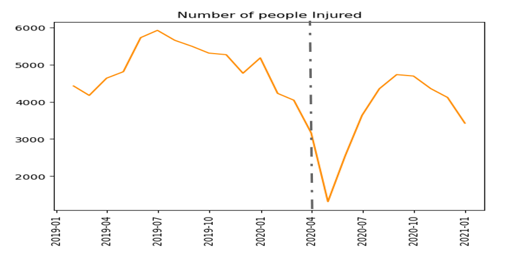
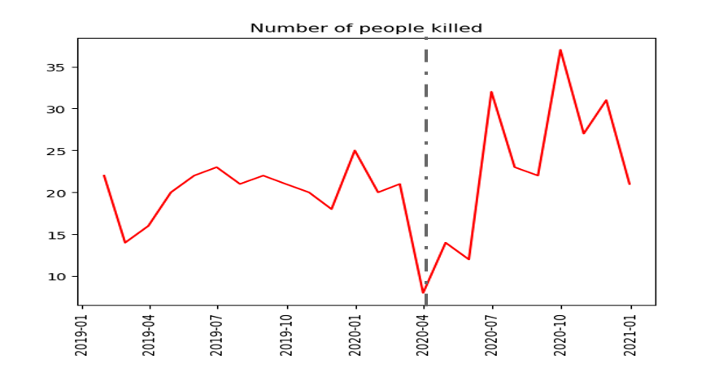
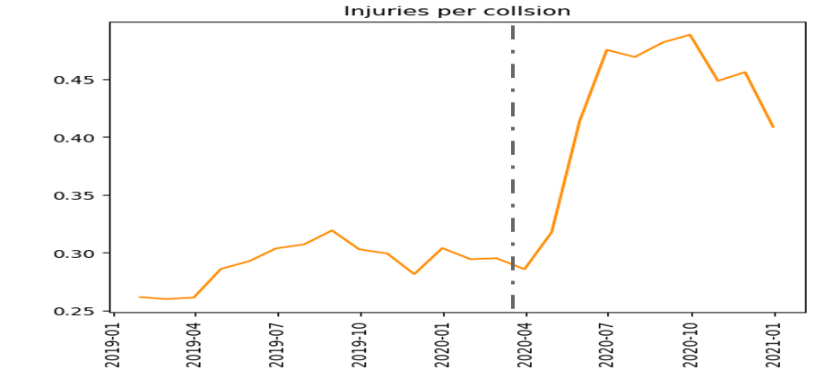
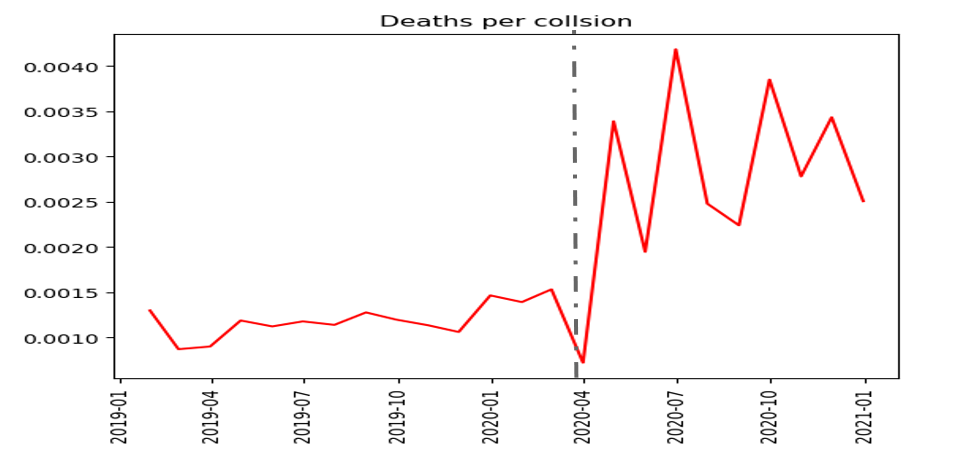

# NYC Traffic Collisions Analysis

## Objective:
[Shefer and Rietveld, 1997](https://doi.org/10.1080/0042098975970) proposes the impact of variations in traffic density to the number and severity of traffic collisions. The lockdown imposed due to COVID pandemic provides a convenient sitaution to check the impact of sudden decrease in traffic density to traffic accidents happening in the NYC area. However, since the change in traffic density can also be intentionally or unintentially brought about due to congestion taxes policies, traffic law changes, public transport schemes, restructuring of roads, etc. it is important to understand its impact on traffic accidents so that policy makers can make better decisions in the future to help ensure the safety of residents of NYC.

There are 2 goals of this project:
1. Analyze the impact of changes in traffic density on the number and severity of traffic accidents in NYC.

2. Build an ETL and R Shiny app that displays the accident prone regions in NYC.

 

## Dataset:
There are 3 datasets used in this project, all of which are taken from the NYC OpenData website. The "Motor Vehicle Collisions - Crashes" dataset maintained by NYPD was used to obtain information on number and severity of accidents. The traffic volume and traffic speed information was obtained from datasets maintained by Metropolitan Transportation Authority (MTA) and Traffic Management Center (TMC) respectively. The links to all the datasets are provided in the data directory.

 

## Analysis:

[Shefer and Rietveld, 1997](https://doi.org/10.1080/0042098975970) proposes that as the traffic density increases the number of accidents also increases, which seems intuitive. However, what's counter-intuitive at the first glance is that relation between traffic density and accident severity. Shefer proposes that as the traffic density decreases the severity of the accidents increases, because in lower traffic densities people tend to drive their cars faster. In this section we will see Shefer's thesis conforms with the accidents in NYC during the lockdown.

The below analysis is performed on data 1 year prior to and during lockdown. The gray dotted line in the graphs indicate the lockdown commencement.

  

 

As expected, we can see that the traffic volume decreased when the lockdown was announced. As the same time, we also observe a sharp decrease the the number of accidents happening in NYC.

 

 

 

 

However, at the same time when the total number of accidents decreased, it seems that the total number of people getting injured did not decrease as sharply as the number of accidents. What's even more disturbing is the fact that the number of deaths due to road accidents seems to have increased in the same period.

 

 

 

The above plots show the numnber of people getting injured and killed per accident (which is a measure of accident severity), and we can see that the severity of accidents significantly shot up during the lockdown.

 

Though the above displayed graphs are for aggregated data at city level, similar trends were observed at each borough level. So, we see that results observed conform with [Shefer and Rietveld, 1997](https://doi.org/10.1080/0042098975970), and this shows how complicated it can be to pass any kind of traffic policy. Whenever any kind of policies are passed that might directly impact traffic density, one would like to ensure that the policy did not end up having any unintended consequences. The R Shiny app discussed in the below section provides a convinient way to monitor changes in accident prone regions.

